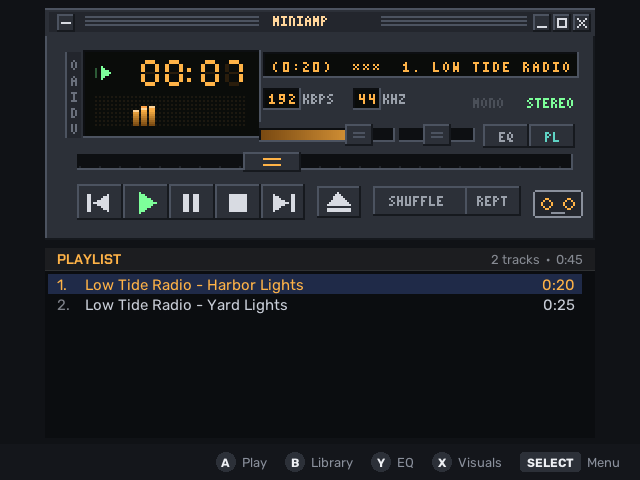
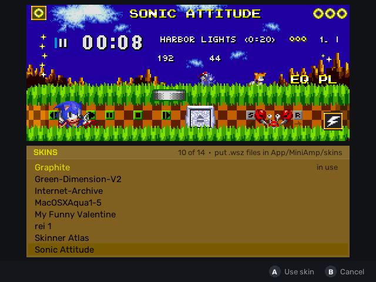

# MiniAmp

A classic-skin music player for the **Miyoo Mini Plus** (OnionOS).

- Plays MP3, FLAC, Ogg Vorbis and WAV (any sample rate, mono or stereo)
- Loads classic `.wsz` skins; ships with an original skin, "Graphite"
- Skin browser with live preview
- 10-band equalizer with presets (including one tuned for the built-in speaker)
- Spectrum / oscilloscope in the main window, five full-screen visualizers
- Music library browser, playlists (`.m3u`), shuffle, repeat, sleep timer
- Screen-off playback
- **Music in games**: quit while playing and the music keeps going in the OnionOS menu, in games and in apps (SELECT + L/R skip, SELECT + Up/Down volume, SELECT + START pause)

MiniAmp is an independent project, written from scratch. It is not affiliated
with Winamp, Nullsoft or Llama Group and contains no Winamp code or artwork.

> **Built by Claude.** This player was written by Claude (Anthropic's AI) working with Keith Snyder.

Skins from the classic era load as-is (shown here: the skin browser previewing a downloaded skin):

## Install

Copy `App/MiniAmp` from the release zip to the SD card, or install it with
[Mixtape](https://github.com/snyderman3000/mixtape). See `pkgsrc/README.txt`
for controls.

## How music in games works

OnionOS's audioserver takes a single stream of audio, so two programs playing at once
chop each other up. Instead, MiniAmp's background service decodes into shared memory and a
small wrapper around OnionOS's `libpadsp.so` (which the menu and every game load) mixes
that music into the program's own sound before it reaches the audioserver. The original
library is kept as `libpadsp_orig.so` and restored when the option is turned off. See
`src/padsp_wrap.c` and `src/gamemusic.c`.

**Uninstalling.** Erasing MiniAmp in [Mixtape](https://github.com/snyderman3000/mixtape)
(0.1.5 or later) runs `mixtape-uninstall.sh` first, which stops the background music and
puts the original library back. If you delete the folder by hand, turn Music in games off
first, or run `App/MiniAmp/mixtape-uninstall.sh` yourself.

## Building

See [docs/BUILDING.md](docs/BUILDING.md).

## License

MIT (see LICENSE). Third-party components: THIRD_PARTY_NOTICES.md.
